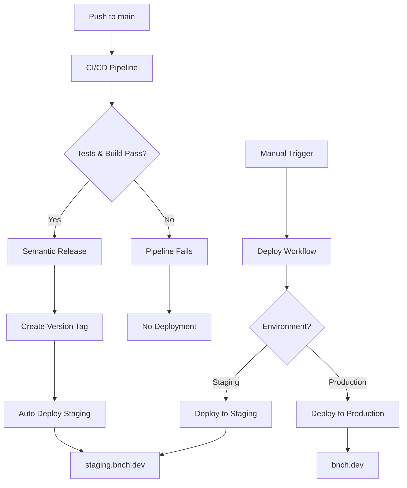

# CI/CD Pipeline Documentation

## Overview

This repository uses a comprehensive CI/CD pipeline that automatically deploys to staging on successful builds and provides manual deployment options for production.

## Workflow Architecture



## Workflows

### 1. CI/CD Pipeline (`ci-cd.yml`)

**Trigger**: Push to `main` or pull request
**Purpose**: Main quality gate - tests, builds, and releases

**Jobs**:
- **Test**: Runs ESLint and unit tests
- **Build**: Creates production build and uploads artifacts
- **Semantic Release**: Creates version tags and releases (main branch only)

### 2. Auto Deploy to Staging (`auto-deploy-staging.yml`)

**Trigger**: Completion of CI/CD Pipeline on `main` branch
**Purpose**: Automatically deploy to staging when CI/CD succeeds

**Logic**:
1. ✅ Wait for CI/CD pipeline to complete
2. ✅ Check if pipeline succeeded
3. ✅ Verify it was triggered by `main` branch
4. ✅ Find latest semantic version tag
5. ✅ Deploy to staging using latest version
6. ✅ Notify success/failure

**Key Features**:
- Only deploys on CI/CD success
- Automatically uses newest version tag
- Comprehensive error handling and notifications
- Skips deployment if conditions aren't met

### 3. Manual Deploy (`deploy.yml`)

**Trigger**: Manual workflow dispatch or workflow call
**Purpose**: Flexible deployment to staging or production

**Parameters**:
- `version`: Specific version to deploy (optional - uses latest if empty)
- `environment`: `staging` or `production`
- `dry_run`: Test deployment without uploading files

### 4. Pull Request Tests (`pr-tests.yml`)

**Trigger**: Pull requests to `main`
**Purpose**: Quick validation for PRs

### 5. Rollback (`rollback.yml`)

**Trigger**: Manual workflow dispatch
**Purpose**: Rollback to previous deployment

## Deployment Flow

### Automatic Staging Deployment

1. **Developer pushes to main**
2. **CI/CD Pipeline runs**:
   - Linting and tests
   - Build verification
   - Semantic release (creates version tag)
3. **Auto-deploy triggers** (only if CI/CD succeeds):
   - Detects latest version tag
   - Calls deploy workflow with staging environment
   - Deploys to https://staging.bnch.dev
4. **Notifications sent** with deployment status

### Manual Production Deployment

1. **Navigate to GitHub Actions**
2. **Select "Deploy to Dreamhost" workflow**
3. **Click "Run workflow"**
4. **Configure deployment**:
   - Environment: `production`
   - Version: (leave empty for latest, or specify version)
   - Dry run: `false`
5. **Deployment executes** to https://bnch.dev

## Version Management

The pipeline uses **semantic versioning** with automatic version bumping:

- **Patch**: `fix:` commits (e.g., 1.0.0 → 1.0.1)
- **Minor**: `feat:` commits (e.g., 1.0.0 → 1.1.0)  
- **Major**: `BREAKING CHANGE:` in commit body (e.g., 1.0.0 → 2.0.0)

## Environment Configuration

### Staging
- **URL**: https://staging.bnch.dev
- **Auto-deploy**: ✅ Yes (on main branch success)
- **Manual deploy**: ✅ Yes
- **Branch**: Latest version tag from main

### Production  
- **URL**: https://bnch.dev
- **Auto-deploy**: ❌ No (manual only for safety)
- **Manual deploy**: ✅ Yes
- **Branch**: Any version tag (specify in workflow)

## Manual Deployment Tools

### PowerShell Script
```powershell
# Deploy latest to staging
.\deploy-staging.ps1

# Deploy specific version to staging
.\deploy-staging.ps1 -Version 1.2.3

# Test deployment (dry run)
.\deploy-staging.ps1 -DryRun
```

### GitHub CLI
```bash
# Deploy latest to staging
gh workflow run deploy.yml --field environment=staging

# Deploy specific version to production  
gh workflow run deploy.yml --field environment=production --field version=1.2.3

# Dry run
gh workflow run deploy.yml --field environment=staging --field dry_run=true
```

## Security & Access Control

- **Staging deployments**: Can be triggered automatically or manually
- **Production deployments**: Manual approval required (protected environment)
- **Secrets management**: SFTP credentials stored in GitHub Secrets
- **Branch protection**: Main branch requires PR reviews

## Monitoring & Rollback

### Deployment Artifacts
Each deployment creates artifacts with:
- Version information
- Deployment timestamp
- Git commit hash
- Rollback instructions

### Rollback Options
1. **Rollback workflow**: Automated rollback to previous version
2. **Manual redeployment**: Deploy previous version using deploy workflow
3. **Emergency rollback**: Direct SFTP access (last resort)

## Troubleshooting

### Common Issues

**Auto-deployment doesn't trigger**:
- Check if CI/CD pipeline succeeded
- Verify semantic-release created a version tag
- Check workflow run logs for condition failures

**Deployment fails**:
- Verify SFTP credentials are correct
- Check build artifacts exist
- Review deployment workflow logs

**Version tag missing**:
- Ensure commits follow conventional commit format
- Check semantic-release configuration
- Verify GitHub token permissions

### Support Commands
```bash
# Check latest tags
git tag --sort=-version:refname | head -5

# View workflow status
gh run list --workflow=ci-cd.yml

# Check deployment history
gh run list --workflow=deploy.yml
```

## Best Practices

1. **Use conventional commits** for automatic versioning
2. **Test thoroughly in staging** before production deployment
3. **Monitor deployments** through GitHub Actions
4. **Keep deployment artifacts** for rollback capability
5. **Use dry runs** to test deployment changes
6. **Review deployment summaries** for issues
